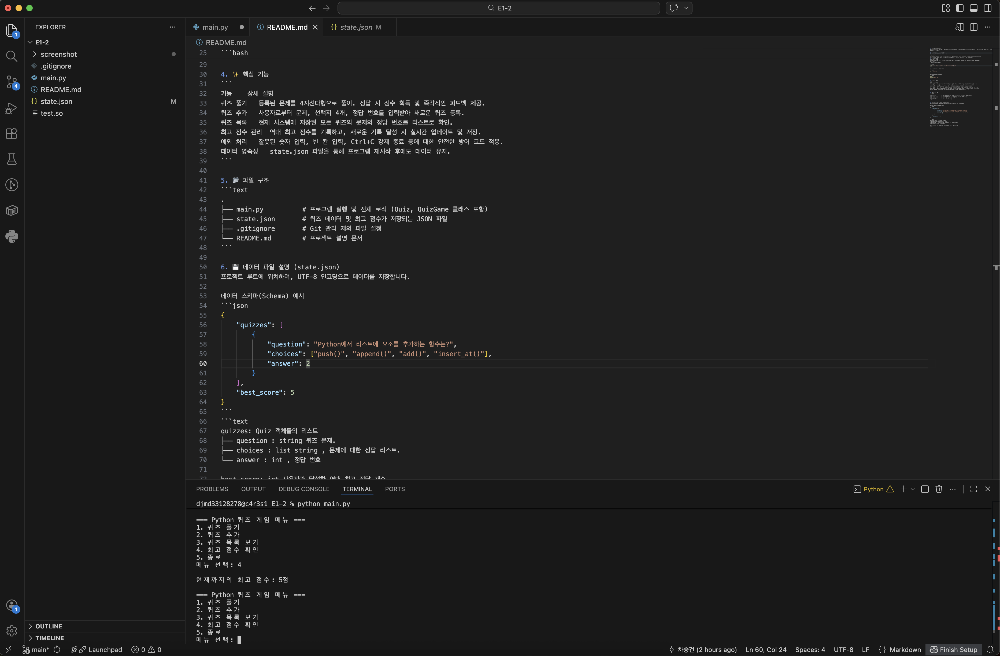

1. 프로젝트 개요
프로젝트 명: quiz-game
개발 목표:
Quiz / QuizGame 클래스를 활용한 객체지향 프로그래밍(OOP) 실습
JSON 파일 입출력을 통한 데이터 저장 및 로드
잘못된 입력, 파일 손상, 강제 종료(Ctrl+C)에도 안전한 예외 처리 구현

✨ 2. 주요 기능
기능	               설명
1. 퀴즈 풀기        	등록된 모든 퀴즈를 순서대로 출제, 4지선다 채점 및 오답 시 정답 안내
2. 퀴즈 추가	        문제, 선택지 4개, 정답 번호(1~4)를 입력받아 즉시 state.json에 저장
3. 퀴즈 목록 보기        등록된 모든 퀴즈의 문제와 정답 번호 확인
4. 최고 점수 확인	     현재까지의 최고 점수 조회
5. 종료                프로그램을 안전하게 종료
자동 저장/복구	파일이 없으면 기본 5개 퀴즈 자동 생성, 손상 시 기본 데이터로 복구
🚀 3. 실행 방법 및 요구 환경
요구 환경
Python 3.x (표준 라이브러리 json, os만 사용, 외부 설치 불필요)
실행 방법
```bash
# 저장소 복제
git clone https://github.com/username/quiz-game.git
cd quiz-game
```
```bash
# 프로그램 실행
python main.py
🎮 4. 사용 방법
프로그램을 실행하면 아래 메뉴가 나타납니다. 원하는 번호(1~5)를 입력하세요.
```


```text
=== Python 퀴즈 게임 메뉴 ===
1. 퀴즈 풀기
2. 퀴즈 추가
3. 퀴즈 목록 보기
4. 최고 점수 확인
5. 종료
메뉴 선택:
```
📁 5. 프로젝트 구조
```text
quiz-game/
├── main.py          # 전체 코드 (Quiz, QuizGame 클래스 + 진입점)
├── state.json       # 퀴즈 데이터 및 최고 점수 저장 파일 (자동 생성)
└── README.md        # 프로젝트 안내서
```

🏗️ 6. 클래스 구조
Quiz (개별 문제 클래스)
속성/메서드	역할
question	문제 내용
choices	선택지 리스트 (4개)
answer	정답 번호 (1~4 정수)
to_dict()	JSON 저장을 위한 딕셔너리 변환

QuizGame (게임 컨트롤러 클래스)
메서드	              역할
load_data()	        JSON 로드 또는 기본 데이터 설정
save_data()	        현재 상태를 JSON으로 저장
get_safe_input()	공백·타입·범위를 검증하는 안전한 입력
play_quiz()	        퀴즈 출제, 채점, 최고 점수 갱신
add_quiz()	        새 퀴즈 추가
show_list()	        퀴즈 목록 출력
show_best_score()	최고 점수 출력
run()	            메인 메뉴 루프 및 강제 종료 안전 처리

💾 7. state.json 스키마
ensure_ascii=False, indent=4 옵션으로 한글이 깨지지 않고 가독성 있게 저장됩니다. indent: 들여쓰기 갯수.

```json
{
    "quizzes": [
        {
            "question": "Python에서 리스트에 요소를 추가하는 함수는?",
            "choices": ["push()", "append()", "add()", "insert_at()"],
            "answer": 2
        }
    ],
    "best_score": 5
}
```
🛡️ 8. 입력 및 예외 처리 전략
안전한 입력 (get_safe_input): 공백, 숫자가 아닌 값(ValueError), 지정 범위 초과 시 멈추지 않고 재입력을 유도합니다.
필수 값 검증: 퀴즈 추가 시 문제와 선택지가 비어 있으면 다시 입력받습니다.
파일 예외 복구: state.json이 없으면 기본 퀴즈를 생성하고, 손상(JSONDecodeError, IOError) 시 기본 데이터로 복구합니다.
강제 종료 대응: Ctrl+C(KeyboardInterrupt)나 EOFError 발생 시, 데이터를 안전하게 저장한 뒤 종료합니다.

💡 9. 학습한 내용 (Lessons Learned)
객체지향 설계: Quiz 클래스로 데이터를 캡슐화하고, QuizGame으로 로직을 관리했습니다.
JSON 직렬화: 파이썬 객체와 JSON 딕셔너리 간 상호 변환 방법을 익혔습니다.
견고한 예외 처리: 오입력·파일 손상·강제 종료까지 대비하여 프로그램의 안정성을 높였습니다.

게임 실행 화면.


깃 로그 확인


실행 환경 스크린샷



