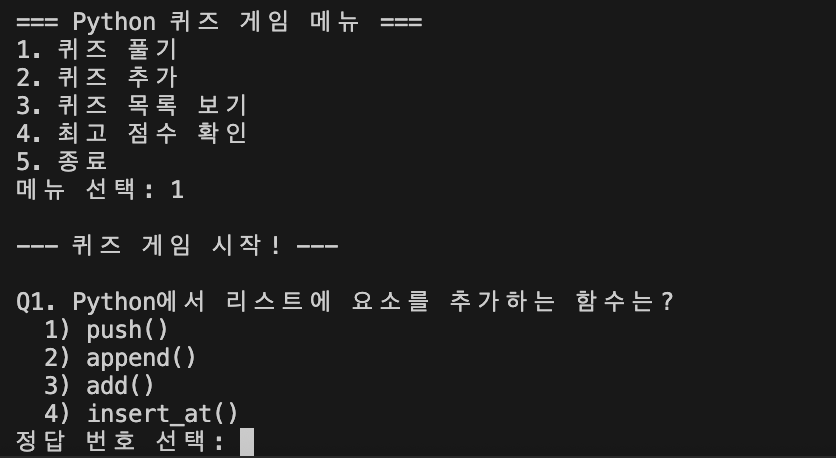

1. 📝 프로젝트 개요
터미널(Console) 환경에서 동작하는 퀴즈 게임입니다. 사용자는 기본으로 제공되는 Python 관련 퀴즈를 풀 수도 있고, 직접 새로운 문제를 추가하여 나만의 퀴즈 뱅크를 만들 수도 있습니다. 모든 데이터는 JSON 파일로 관리되어 프로그램 종료 후에도 유지됩니다.

2. 🎯 퀴즈 주제 및 선정 이유
```
주제: Python 기초 프로그래밍 상식
선정 이유:
프로그래밍을 처음 배울 때 헷갈리기 쉬운 자료형(List, Dict, Tuple)의 특징을 복습하기 위함입니다.
단순 암기가 아닌, 실제 코드가 어떻게 동작하는지 퀴즈를 통해 점검할 수 있습니다.
```

3. 🚀 실행 방법
저장소를 복제합니다.

```bash
git clone https://github.com/chacharrot/E1-2.git
```

프로젝트 폴더로 이동합니다.
```bash
cd 저장소이름
```Í

프로그램을 실행합니다.
```bash
bash
python main.py
```

4. ✨ 핵심 기능
```
기능	상세 설명
퀴즈 풀기	등록된 문제를 4지선다형으로 풀이. 정답 시 점수 획득 및 즉각적인 피드백 제공.
퀴즈 추가	사용자로부터 문제, 선택지 4개, 정답 번호를 입력받아 새로운 퀴즈 등록.
퀴즈 목록	현재 시스템에 저장된 모든 퀴즈의 문제와 정답 번호를 리스트로 확인.
최고 점수 관리	역대 최고 점수를 기록하고, 새로운 기록 달성 시 실시간 업데이트 및 저장.
예외 처리	잘못된 숫자 입력, 빈 칸 입력, Ctrl+C 강제 종료 등에 대한 안전한 방어 코드 적용.
데이터 영속성	state.json 파일을 통해 프로그램 재시작 후에도 데이터 유지.
```

5. 📂 파일 구조
```text
.
├── main.py          # 프로그램 실행 및 전체 로직 (Quiz, QuizGame 클래스 포함)
├── state.json       # 퀴즈 데이터 및 최고 점수가 저장되는 JSON 파일
├── .gitignore       # Git 관리 제외 파일 설정
└── README.md        # 프로젝트 설명 문서
```

6. 💾 데이터 파일 설명 (state.json)
프로젝트 루트에 위치하며, UTF-8 인코딩으로 데이터를 저장합니다.

데이터 스키마(Schema) 예시
```json
{
    "quizzes": [
        {
            "question": "Python에서 리스트에 요소를 추가하는 함수는?",
            "choices": ["push()", "append()", "add()", "insert_at()"],
            "answer": 2
        }
    ],
    "best_score": 5
}
```
```text
quizzes: Quiz 객체들의 리스트
├── question : string 퀴즈 문제.
├── choices : list string , 문제에 대한 정답 리스트.
└── answer : int , 정답 번호

best_score: int 사용자가 달성한 역대 최고 정답 개수
```



